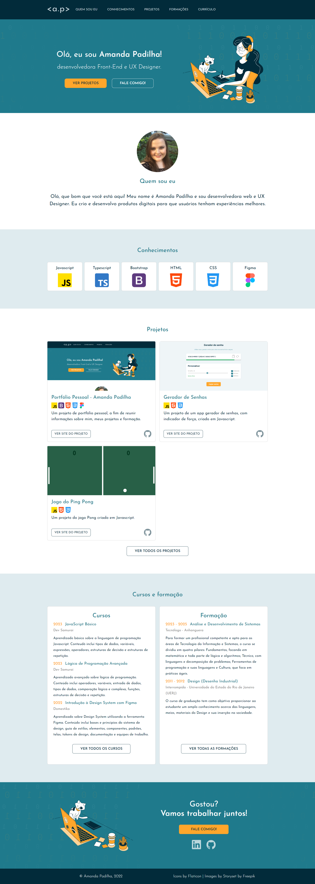

# Muy personal portfolio

This is a personal project of my portfolio, created with HTML, CSS, Bootstrap, DOM and Javascript (Vanilla). The objective of this project was to show my personal skills of web development.

---
## Table of contents

- [Overview](#🌞-overview)
  - [Screenshot](#📸-screenshot)
  - [Links](#🔗-links)
- [My process](#🤔-my-process)
  - [Built with](#🏗️-built-with)
  - [What I learned](#🧠-what-i-learned)
  - [Useful resources](#👩‍💻-useful-resources)
- [Author](#😸-author)

---

## 🌞 Overview

### :camera_flash: Screenshot



### 🔗 Links

- Solution URL: [GitHub Repository](https://github.com/Padilha04/Portfolio)
- Live Site URL: [GitHub Page](https://padilha04.github.io/Portfolio)

---

## 🤔 My process

### 🏗️ Built with

- Semantic HTML5 markup
- CSS3 custom properties
- Bootstrap
- Javascript (Vanilla)
- DOM

### 🧠 What I learned

I learned a lot in this project, because I was able to pratice a lot of programming languages, including Javascript. Particulary, I was very proud of implementing my projects and courses dinamically using DOM manipulation. 

```javascript
function createCardProject(projectObj) {
  const newDivCol = document.createElement("div");
  newDivCol.classList.add("col");

  cardsProjectsRowEl.append(newDivCol);

  const newDivCard = document.createElement("div");
  newDivCard.classList.add("card","h-100", "transitionsmooth");

  newDivCol.append(newDivCard);

  const newDivImg = document.createElement("div");
  newDivImg.classList.add("divimg", "transitionsmooth2")
  newDivImg.style.backgroundImage = `url(${projectObj.imgSrc})`;

  newDivCard.append(newDivImg);
 

  const newDivCardBody = document.createElement("div");
  newDivCardBody.classList.add("card-body");

  newDivCard.append(newDivCardBody);

  const newH5 = document.createElement("h5");
  newH5.classList.add("card-title");
  newH5.innerHTML = projectObj.title;

  newDivCardBody.append(newH5);

  const newDivBadges = document.createElement("div");
  newDivBadges.classList.add("card-badge");

  newDivCardBody.append(newDivBadges);

  //Badges Check

  for (value of knowledgeArray) {
    if(projectObj.tech.includes(value)) {
        const newBadge = document.createElement("img");
        newBadge.setAttribute("src", `./img/${value}.png`);
        newDivBadges.append(newBadge);
    }
  }

  const newP = document.createElement("p");
  newP.classList.add("card-text");
  newP.innerHTML = projectObj.text;

  newDivCardBody.append(newP);

  const newDivButtons = document.createElement("div")
  newDivButtons.classList.add("btns-cards")
  
  newDivCard.append(newDivButtons)

  const newLinkBtn2 = document.createElement('a')
  newLinkBtn2.setAttribute("href", `${projectObj.hrefSite}`)
  newLinkBtn2.setAttribute("target", "_blank")
  newDivButtons.append(newLinkBtn2)

  const newButton2 = document.createElement("button")
  newButton2.classList.add("btn", "btn-outline-primary-oncard", "transitionsmooth2")
  newButton2.innerHTML = "VER SITE DO PROJETO"
  
  newLinkBtn2.append(newButton2)

  const newLinkGit2 = document.createElement('a')
  newLinkGit2.setAttribute("href", `${projectObj.hrefGitHub}`)
  newLinkGit2.setAttribute("target", "_blank")
  newDivButtons.append(newLinkGit2)

  const newImgGit2 = document.createElement ('img')
  newImgGit2.setAttribute("src", "./img/github2.svg")
  newImgGit2.classList.add("github-img2")

  newLinkGit2.append(newImgGit2)
 

  newDivCard.addEventListener("mouseenter", ()=>{
  
    newDivImg.style.opacity = "0.8"
    newDivCard.style.borderColor = "#1f7a8c"
    
  })
  newDivCard.addEventListener("mouseleave", ()=>{
    newDivImg.style.opacity = "1"

    newDivCard.style.borderColor = "rgba(0, 0, 0, 0.175)"

  })


}

function createAllProjCards() {
  for (value of projectsArray) {
    createCardProject(value);
  }
}
```

### 👩‍💻 Useful resources

- [Bootstrap Cards Documentation](https://getbootstrap.com/docs/5.3/components/card/) - This documentation of Bootstrap was essential to make ma=y card align properly in each screen dimentions.

---

## 😸 Author

### Amanda Padilha
- Portfolio Web Developer [Amanda Padilha](https://padilha04.github.io/Portfolio)
- Portfolio UX - [Amanda Padilha](https://amandapadi.notion.site/Amanda-Padilha-Portf-lio-f5cc302c77014bea8a538ab908342784)
- Github - [Padilha04](https://github.com/Padilha04)
- LinkedIn - [Amanda Padilha](www.linkedin.com/in/amanda-padilha)
- Frontend Mentor - [@Padilha04](https://www.frontendmentor.io/profile/yourusername)